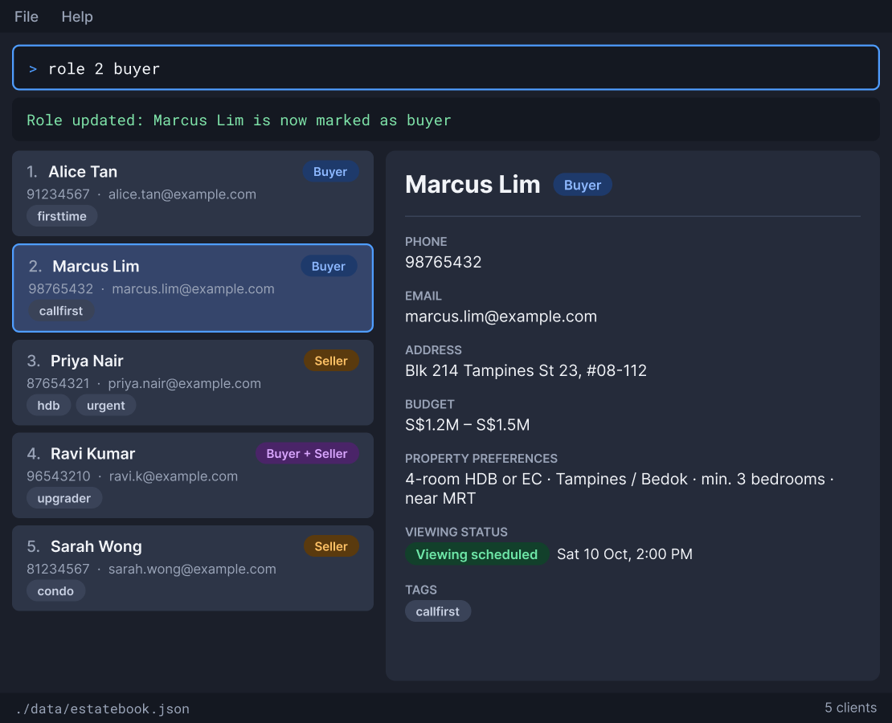

# EstateBookUltraProMax

EstateBookUltraProMax is a desktop contact book for property agents who manage
many buyers and sellers at once. Every action is a short command typed into the
command box, and the result appears in the GUI.

Each contact stores the client's details along with the budget, the preferred
areas and property type, the viewing status and the next follow-up date. Property
and viewing details are kept as context for the contact.

Records are stored in one file that can be opened and edited by hand. There is no
server and no database.

* Mark a client as a buyer, a seller, or both.
* Find someone by part of a name, or list everyone.
* If you can type fast, EstateBookUltraProMax can get your client management
  tasks done faster than a mouse-driven app.

Useful links:
* [Product Website](https://ay2627s1-cs2103t-w09-3.github.io/tp/)
* [User Guide](https://ay2627s1-cs2103t-w09-3.github.io/tp/UserGuide.html)
* [Developer Guide](https://ay2627s1-cs2103t-w09-3.github.io/tp/DeveloperGuide.html)

Acknowledgements:
* This project is based on the AddressBook-Level3 project created by the
  [SE-EDU initiative](https://se-education.org).
