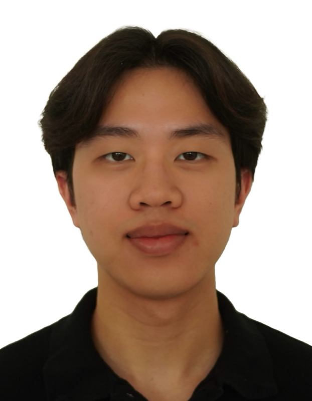
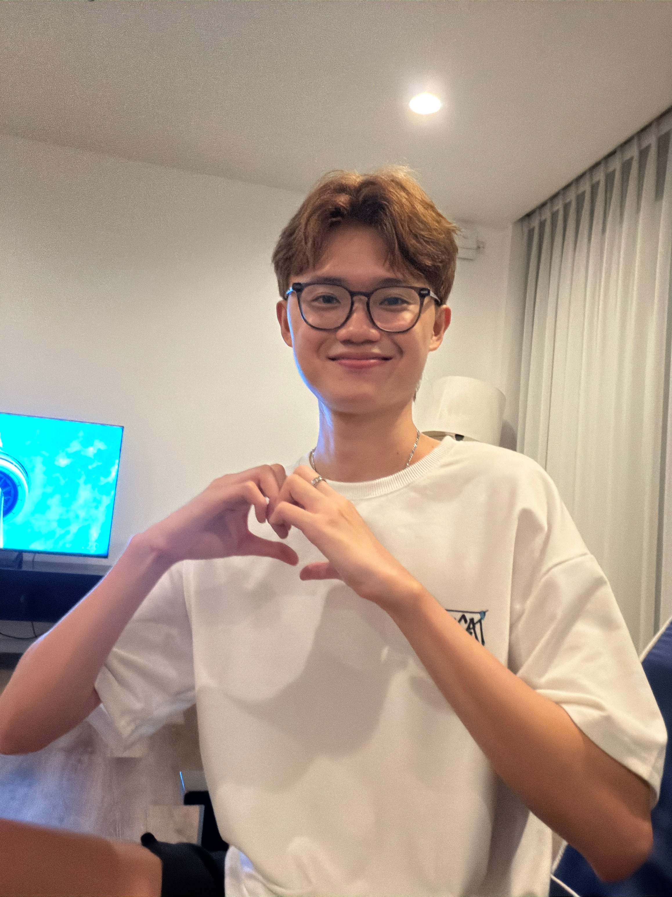

We are a team based in the [School of Computing, National University of Singapore](https://www.comp.nus.edu.sg).

You can reach us at the email `seer[at]comp.nus.edu.sg`

## Project team

### John Doe

[[homepage](http://www.comp.nus.edu.sg/~damithch)]
[[github](https://github.com/johndoe)]
[[portfolio](team/johndoe.md)]

* Role: Project Advisor

### Fyn Chua Yu En

[[github](https://github.com/ffynch)]

* Role: Developer
* Responsibilities: Deliverables and deadlines

### Jaren Yap

[[github](https://github.com/jarenyap)]

* Role: Developer
* Responsibilities: Code quality

### Chew Jia You

[[github](http://github.com/jiayouchew)]

* Role: Developer
* Responsibilities: Integration

### James Doe

[[github](http://github.com/johndoe)]
[[portfolio](team/johndoe.md)]

* Role: Developer
* Responsibilities: UI
