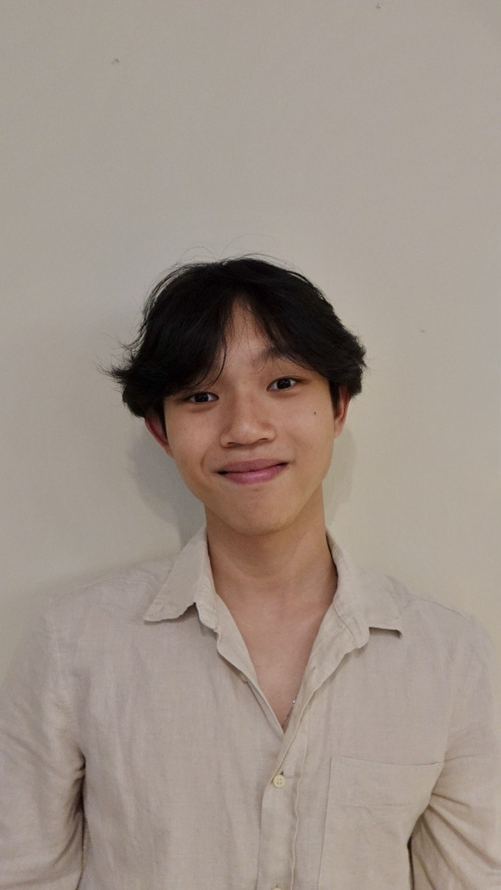

We are a team based in the [School of Computing, National University of Singapore](https://www.comp.nus.edu.sg).

You can reach us at the email `seer[at]comp.nus.edu.sg`

## Project team

### Fyn Chua Yu En

[[github](https://github.com/ffynch)]

* Role: Developer
* Responsibilities: Deliverables and deadlines

### Jaren Yap

[[github](https://github.com/jarenyap)]

* Role: Developer
* Responsibilities: Code quality

### Hor Xiang Neng

[[github](http://github.com/rubyherp)]

* Role: Developer
* Responsibilities: Scheduling and Tracking

### Edward Hew

[[github](http://github.com/edwardheww)]

* Role: Developer
* Responsibilities: Testing

### Chew Jia You

[[github](http://github.com/jiayouchew)]

* Role: Developer
* Responsibilities: Integration
